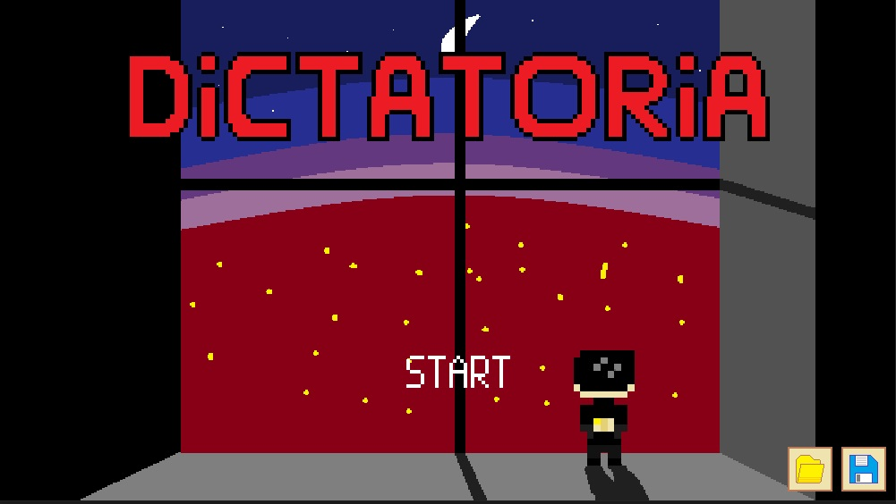
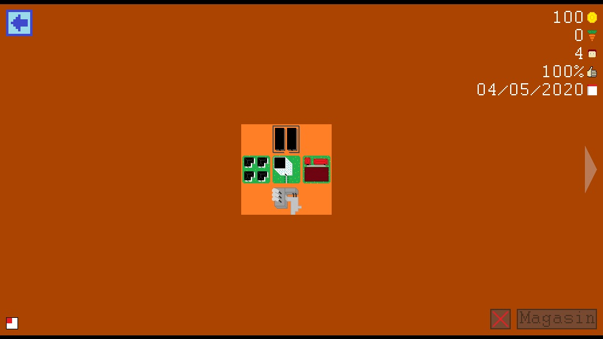
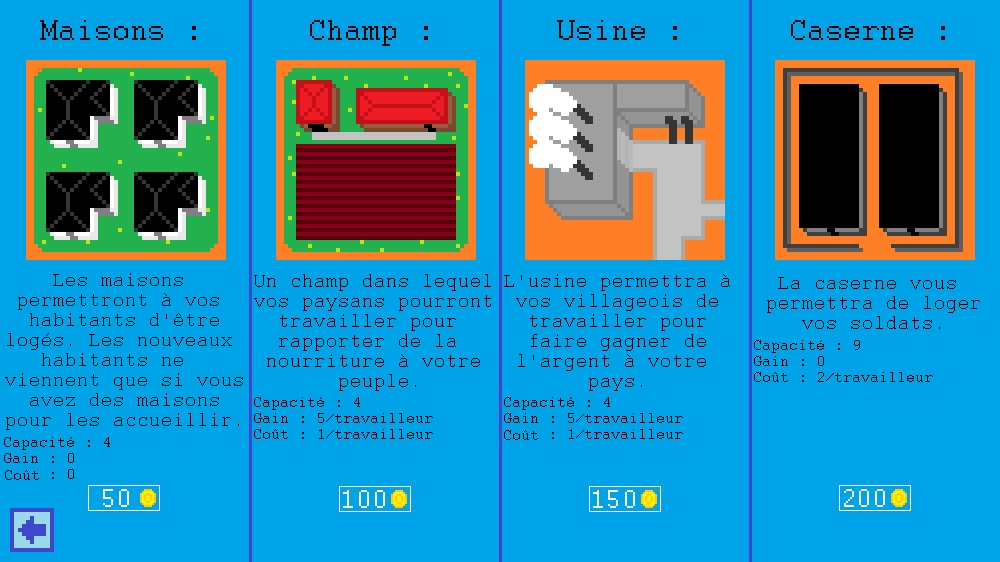
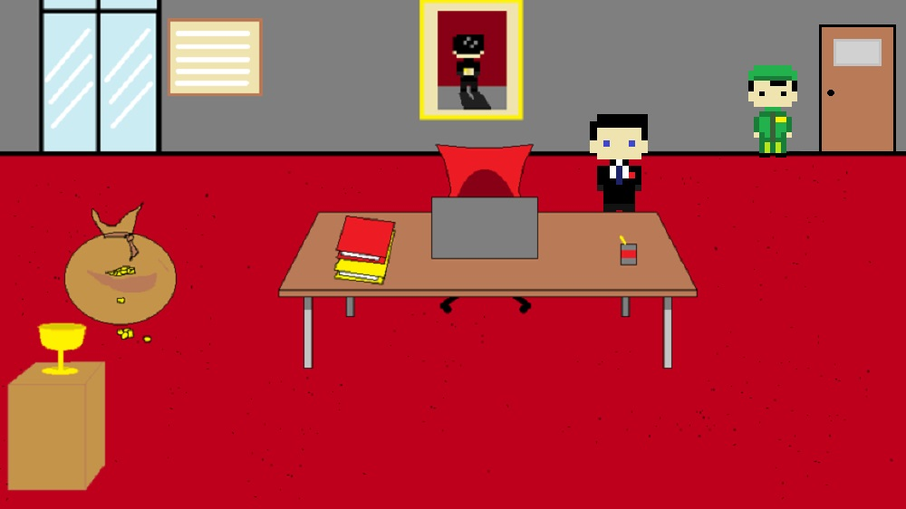

# Python-Dictatoria-Game

Dictatoria is a game project I made with a friend. It's a simple management game with a simple plot : you were the leader of the most powerful nation in the world, but it collapsed. So you decided to build a new nation that you will have to bring to the highest.
## Features
- 4 différent building
- 6 endings
- Opponent cities
- Game speed settings
- Sound settings
- City stats
## Installation
1. Download the repository by clicking on `Code > Download ZIP`
2. Extract the ZIP file
3. Run `main.pyw`
## Requirements
- Python 3.7
- Python `pathlib` library
- Python `os` library
- Python `contextlib` library
- Python `pygame` library
- Python `random` library
## Game Captures

